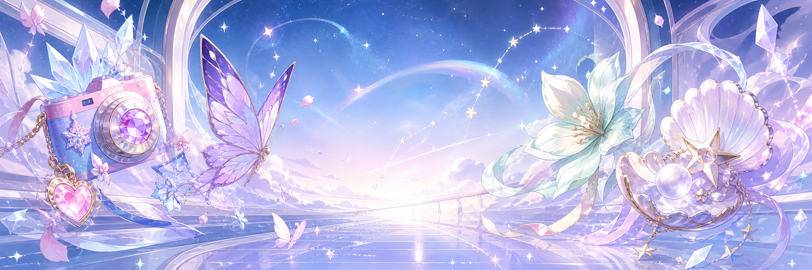

<div align="center">



<h1>Mar7thLover</h1>
<h3>星穹旅人 &nbsp;·&nbsp; Trailblazer &nbsp;·&nbsp; Vibe Coding Learner</h3>

[](https://git.io/typing-svg)

<br />


</div>

---

## About Me &nbsp;·&nbsp; 关于我

<table>
  <tr>
    <td width="150" align="center">
      
    </td>
    <td>
      Hi, I'm <b>Mar7thLover</b> — a Trailblazer both in-game and in code.
      <br />
      <sub><i>星穹铁道里的开拓者，代码世界里认真的学徒。</i></sub>
      <br /><br />
      I chase the quiet satisfaction of making things that feel <i>right</i>: clean interfaces, playful interactions, game-inspired worlds, and small ideas polished until they glow.
      <br />
      <sub><i>喜欢把灵感打磨到发光 —— 干净、灵动、优雅，带一点点梦幻。</i></sub>
    </td>
  </tr>
</table>

> **Between star rails and syntax** — learning to shape small worlds that feel right.
> <br /><sub><i>在星轨与代码之间，练习把想象变成能运行的世界。</i></sub>

<table>
  <tr>
    <td>🌌</td><td>Currently refining my craft through <b>Vibe Coding</b>, project practice, and <b>Unity basics</b>.<br /><sub><i>正在用 Vibe Coding、项目实践与 Unity 基础慢慢精进。</i></sub></td>
  </tr>
  <tr>
    <td>🛠️</td><td>I build around game-server experiments, tools, data sites, and small polished ideas.<br /><sub><i>围绕游戏服务端实验、工具、数据站点，以及小而精的点子。</i></sub></td>
  </tr>
  <tr>
    <td>💜</td><td>Mains: <b>三月七</b> · <b>遐蝶</b> · <b>风堇</b> · <b>昔涟</b> — each one a piece of aesthetic identity.<br /><sub><i>每一位都是我审美的一块拼图。</i></sub></td>
  </tr>
</table>

---

## Current Constellation &nbsp;·&nbsp; 当前星图

<table>
  <tr>
    <td width="50%" valign="top">
      <h3>Learning Orbit &nbsp;·&nbsp; 学习轨道</h3>
      <ul>
        <li><b>Vibe Coding</b> — turn inspiration into something runnable.<br /><sub><i>把灵感变成能跑起来的东西。</i></sub></li>
        <li><b>Unity Basics</b> — scenes, components, motion.<br /><sub><i>让小小的世界动起来。</i></sub></li>
        <li><b>Frontend Taste</b> — layout, rhythm, and polish.<br /><sub><i>布局、节奏与细节的打磨。</i></sub></li>
        <li><b>Code Craft</b> — readable structure, small iterations.<br /><sub><i>可读的结构，稳稳的小步迭代。</i></sub></li>
      </ul>
    </td>
    <td width="50%" valign="top">
      <h3>Creative Direction &nbsp;·&nbsp; 创作方向</h3>
      <ul>
        <li>Ethereal, elegant, bright, and moving.<br /><sub><i>飘渺、优雅、明快、动人。</i></sub></li>
        <li>Game-inspired UI and interactive storytelling.<br /><sub><i>取材自游戏的界面与互动叙事。</i></sub></li>
        <li>Small tools that feel smooth and intentional.<br /><sub><i>顺手、克制、有目的的小工具。</i></sub></li>
        <li>Projects with a little starlight and a clear purpose.<br /><sub><i>带点星光，也有清晰方向的项目。</i></sub></li>
      </ul>
    </td>
  </tr>
</table>

---

## Character Mains &nbsp;·&nbsp; 编队

<div align="center">

| 三月七 | 遐蝶 | 风堇 | 昔涟 |
| :--: | :--: | :--: | :--: |
| Ice-bright energy | Quiet elegance | Gentle vitality | Poetic mystery |
| `cheerful` `brave` | `ethereal` `graceful` | `soft` `healing` | `dreamlike` `radiant` |

<sub><i>四位主控，四种气质 —— 也是这个主页的配色与心情。</i></sub>

</div>

---

## Featured Repositories &nbsp;·&nbsp; 代表项目

<table>
  <tr>
    <td width="50%" valign="top">
      <h3><a href="https://github.com/Mar7thLover/CastoricePS">CastoricePS</a></h3>
      <p>A re-implementation of a game server — stars, rails, and low-level craft.</p>
      <p><sub><i>游戏服务端的重写 —— 星与轨道，以及底层的手艺。</i></sub></p>
      <p>
        
        
      </p>
    </td>
    <td width="50%" valign="top">
      <h3><a href="https://github.com/Mar7thLover/March7thHoney-Public">March7thHoney-Public</a></h3>
      <p>A March 7th themed project — bright spirit, trailblazer energy.</p>
      <p><sub><i>三月七主题的项目 —— 明亮、轻快、向前。</i></sub></p>
      <p>
        
      </p>
    </td>
  </tr>
  <tr>
    <td width="50%" valign="top">
      <h3><a href="https://github.com/Mar7thLover/HyacineDH-Core">HyacineDH-Core</a></h3>
      <p>C# server work, shaped through practice and quiet curiosity.</p>
      <p><sub><i>C# 服务端，在练习与好奇里慢慢成形。</i></sub></p>
      <p>
        
        
      </p>
    </td>
    <td width="50%" valign="top">
      <h3><a href="https://github.com/Mar7thLover/HSR-Database-Web">HSR-Database-Web</a></h3>
      <p>A web template for compiling turn-based anime game data.</p>
      <p><sub><i>整理回合制游戏数据的网页模板。</i></sub></p>
      <p>
        
        
      </p>
    </td>
  </tr>
</table>

---

## Tech Garden &nbsp;·&nbsp; 技术花园

<div align="center">


</div>

---

## GitHub Signals &nbsp;·&nbsp; 数据信号

<div align="center">


<br /><br />

<a href="https://github.com/Mar7thLover?tab=repositories">
  
</a>

</div>

---

## Next Quests &nbsp;·&nbsp; 下一站

```txt
01. Build small, polished things.        · 打磨更多小而精的项目。
02. Make playable scenes, not just ones that run. · 用 Unity 做出能玩的场景。
03. Code with clarity and care.          · 写让未来的自己也能读懂的代码。
04. Stay curious, stay tasteful, keep moving.    · 带着好奇与审美，继续往前。
```

<div align="center">
  <sub>Every small commit is one brighter star. &nbsp;·&nbsp; <i>每一次小小的 commit，都是更亮的一颗星。</i></sub>
</div>
